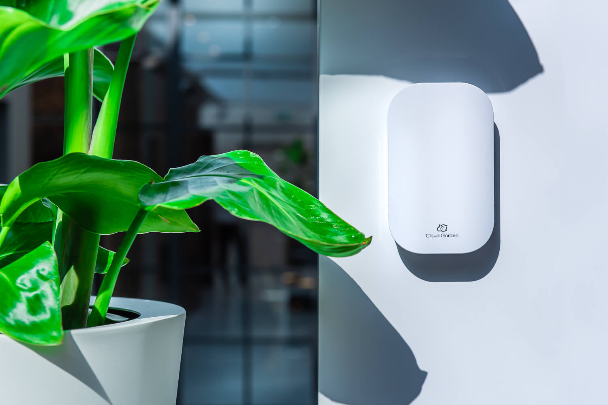

[](https://www.npmjs.com/package/cloud-garden) [](https://standardjs.com)

## About

Support sensor handling for [Cloud Garden](https://cloudgarden.nl/), but can be usefull for any project working with IOT.

## Dependencies

- `None`

## Install

```bash
npm install --save cloud-garden
```

## Examples


## License

MIT © [Sun Labs Nordic](https://github.com/sun-labs)